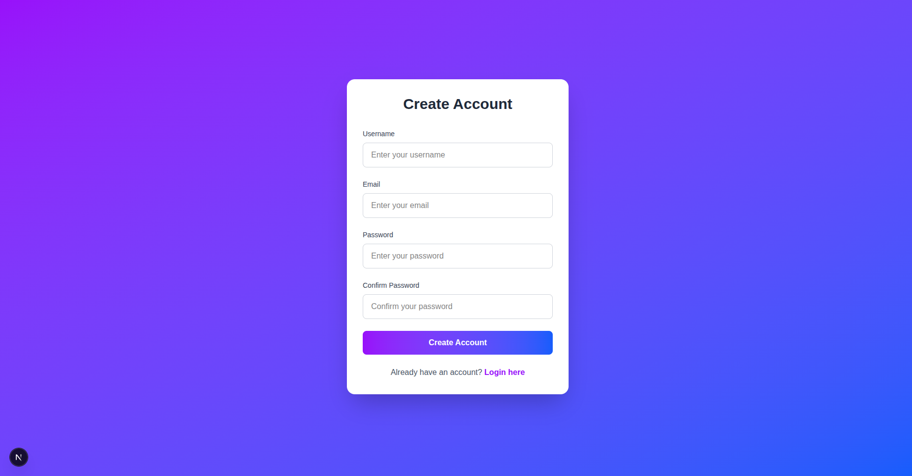
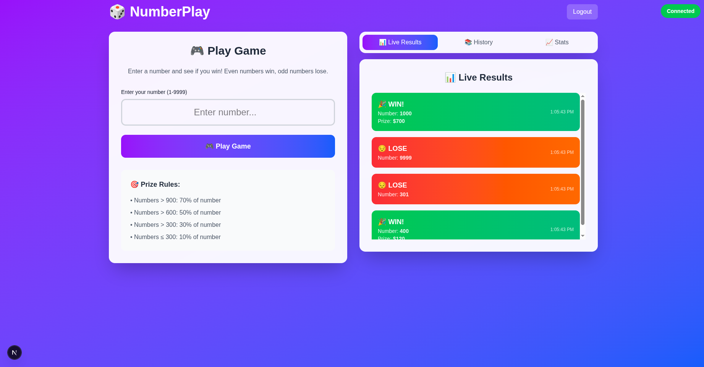

# NumberPlay

A Django app with user authentication and real-time game interaction via WebSocket.

---

## Screenshots

### Registration Page


### Game Interface


---

## Features

- User registration and login (JWT)
- Play a number game: send a number, get instant result
- Real-time results via authenticated WebSocket
- Game history (last 3 results)
- Minimal frontend UI (Next.js)

---

## Main Endpoints

**Auth**
- `POST /auth/api/register/` — Register (username, email, password)
- `POST /auth/api/login/` — Login (email, password)
- `GET /auth/api/user/` — Get current user info

**Game**
- `POST /api/game/play/` — Play game (`{"number": 842}`)
- `GET /api/game/history/` — Last 3 results
- `GET /api/game/statistics/` — User stats

**WebSocket**
- `ws://localhost:8000/ws/game/?token=...` — Real-time game results (JWT required)

**System**
- `GET /health/` — Health check
- `GET /api/docs/` — API docs (Swagger)

---

## Game Logic

- Even number: win, odd: lose
- Prize (if win):
  - >900 — 70%
  - >600 — 50%
  - >300 — 30%
  - ≤300 — 10%
- WebSocket response: `{ "number": 842, "result": "win", "prize": 589.4 }`

---

## Quick Start

```bash
git clone <repo-url>
cd NumberPlay
sudo docker-compose up -d
```

- Frontend: http://localhost:3000
- Backend: http://localhost:8000
- Admin: http://localhost:8000/admin

(Optional) Create admin:
```bash
sudo docker-compose exec backend python manage.py createsuperuser
```

---

## Scaling & Production

### Task Queues
- **Celery + Redis**: Background email sending, data processing
- **Horizontal scaling**: Multiple Celery workers
- **Task monitoring**: Flower dashboard for queue management
- **Retry mechanisms**: Failed task handling with exponential backoff

### Caching Strategy
- **Redis caching**: Game history, user statistics
- **Database query optimization**: Indexed fields for fast lookups
- **Session storage**: Redis-based session management
- **CDN integration**: Static file delivery for frontend

### Security Features
- **JWT authentication**: Secure token-based auth with refresh
- **Rate limiting**: API endpoints protected against abuse
- **Input validation**: Comprehensive data sanitization
- **CORS configuration**: Cross-origin request handling
- **SQL injection protection**: Django ORM safeguards
- **XSS protection**: Built-in Django security headers

### Performance Optimization
- **Database indexing**: Optimized queries for game results
- **Connection pooling**: Efficient database connections
- **Load balancing**: Nginx for multiple backend instances
- **Monitoring**: Health checks and performance metrics

### Deployment Options
- **Docker containers**: Easy deployment and scaling
- **Kubernetes**: For large-scale orchestration
- **Cloud platforms**: AWS, GCP, Azure ready
- **CI/CD**: Automated testing and deployment

---

- Python 3.10+, Django 4.x, DRF, Channels, Celery, Redis, MySQL/SQLite, Daphne, Docker
- All configs are set by default. No manual setup needed. 